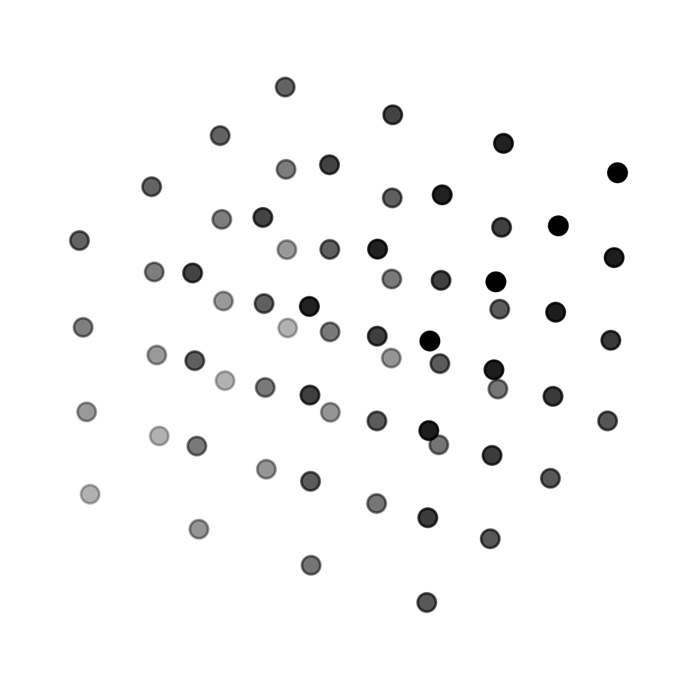

<div align="center">



<h1>Quantize</h1>

<p>An easy-to-use library for quantizing deep neural networks.</p>

</div>

## News or Update

- 2024-05-22 - (Update) - We have released the first version of Quantize.

## Supported Methods

You can find the supported quantization methods in [runner/README.md](runner/README.md).

We also provide the performance comparison of different quantization methods,
please refer to the [configs/README.md](configs/README.md) for more details.

## Setup

Clone this repository

```bash
git clone https://github.com/JingInAI/Quantize.git
cd Quantize
```

Install required packages

```bash
pip install -r requirements.txt
```

Install engine for quantized operators

```bash
cd engine/kernels
python setup.py install
```


## Usage

We provide a simple example to show how to use the library.
You can find the code in the [`scripts`](scripts/) directory.

```python
python -u main.py \
    --cfg configs/${CFG}.yaml \
    --opts model.name=${MODEL}
```

`--cfg` specifies the configuration file.
You can find the configuration files in [`configs/README.md`](configs/README.md).

`--opts` provides additional options to overwrite the configuration file.

All available models are listed in [`modelzoo/README.md`](modelzoo/README.md),
and you can add or directly use the datasets in [`dataset/README.md`](dataset/README.md).

